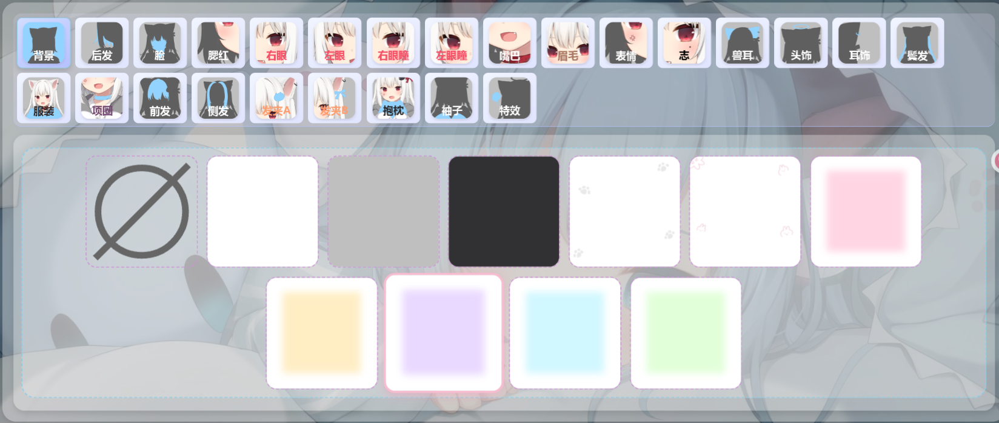
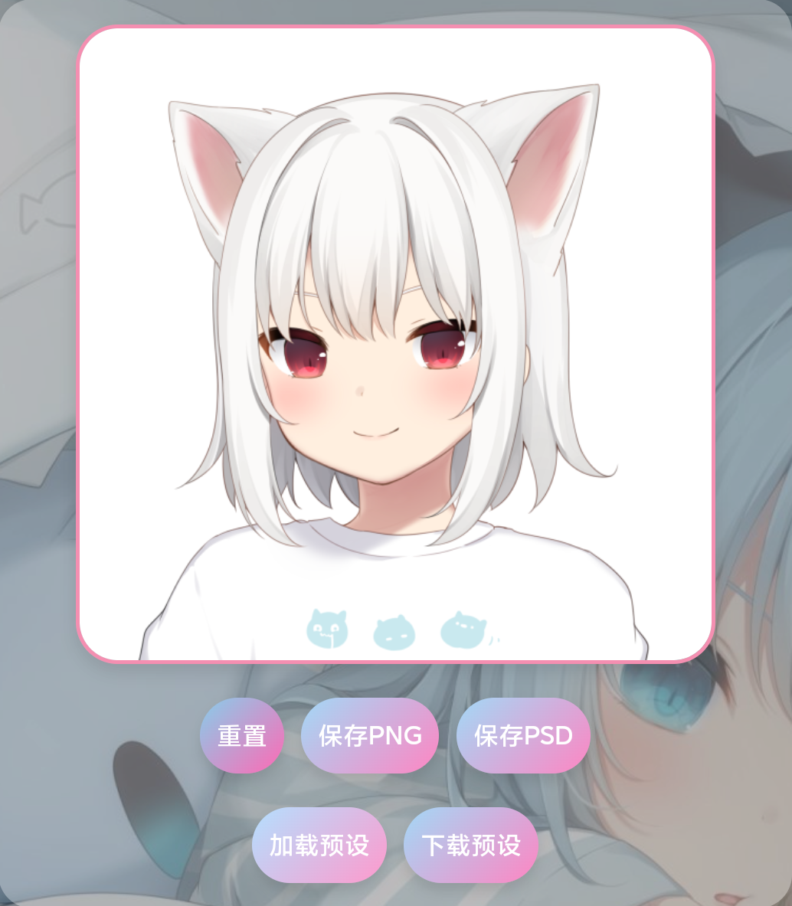
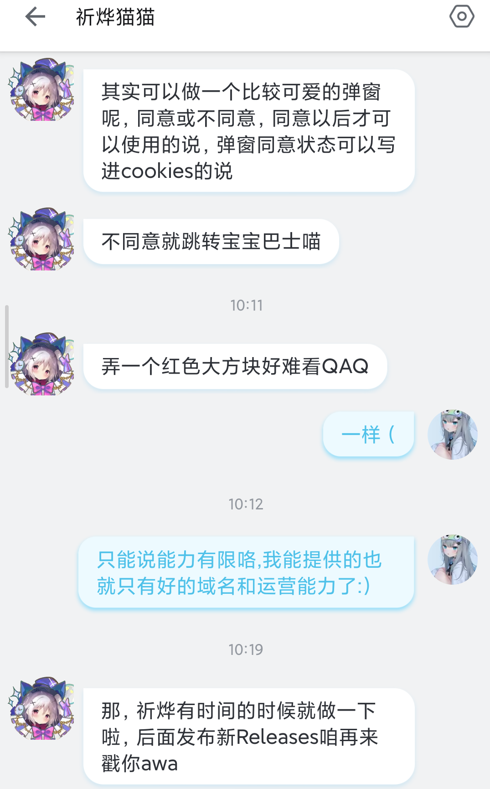
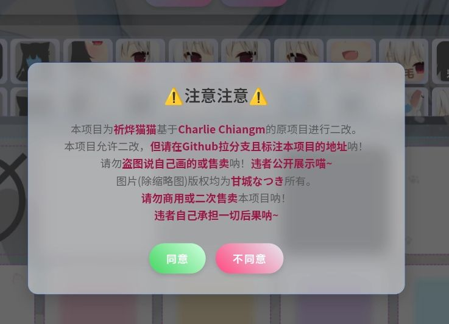
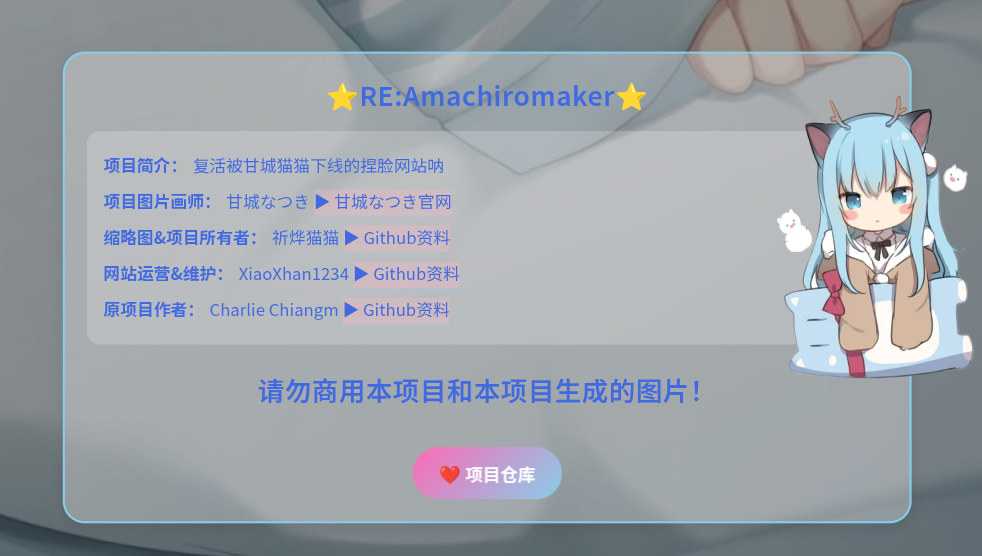

# 项目简介

::github{repo="NekoQiye/RE-Amachiromaker"}

***Amachiromaker*** 是一个用于创建和自定义**二次元**角色形象的网站,它提供了一系列功能，让用户可以自由调整角色的**面部特征、发型、服装**等。

---

# 网站信息

## 网站名称

✨**甘城猫猫捏脸网站**✨

## 功能描述

- 在线捏脸网站
- 支持**超多装扮**自定义组合
- 可下载***预设模板***和*PSD*保存选项
- 拥有**一键重置**

---

# 使用说明

1. 打开**浏览器**,访问[nacho.zako.wf](https://nacho.zako.wf)
2. 下载或上传角色预设（如果需要）
3. 使用提供的**多种装饰**调整**面部特征**、**发型**、**服装**、**表情**等
4. 使用下载预设导出角色模板或保存***PNG***自定义的角色形象

---

# 预计网站更新[`现已更新`]

是的没错,这正是该***框架改版作者***所述,在推出新版***Release***之后,**捏脸网站**即会马上**更新**。

---

# 新增功能说明

## 用户同意协议

- 首次**访问时**会显示用**用户协议**弹窗.
(***同意之后不会再显示***)
- ***明确***说明**数据使用**和**隐私保护**政策.
- 用户需要**同意协议**后才能使用网站功能.
~~(*不同意就跳转宝宝巴士*)~~
- 协议内容涵盖***版权声明、使用规范***.

## 网站底部信息
**网站底部现已添加更多更完整的信息：**

---

# 注意事项

:::note[]
请确保访问的是正确网站,避免钓鱼或恶意网站.
:::
:::important[]
如果网站无法访问,请联系邮箱mc@xhani.top
:::
:::caution[]
请遵守相关法律法规,不得用于非法用途.
:::

